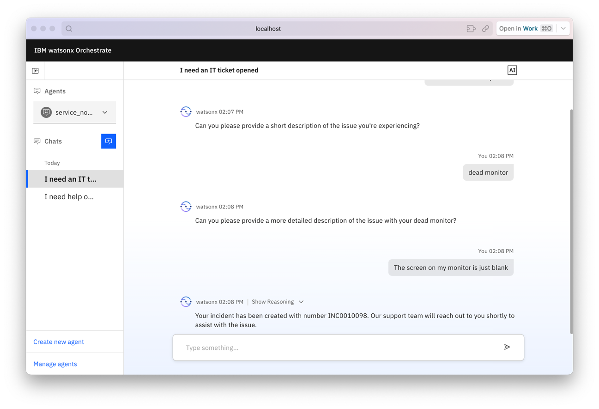

# The watsonx Orchestrate Agent Development Kit (ADK)
[](LICENSE)

[//]: # (![PyPI - Downloads]&#40;https://img.shields.io/pypi/dm/ibm-watsonx-orchestrate&#41;)

<html>
    <h2 align="center">
      
    </h2>
    <h3 align="center">
      <p>Important Links:</p>
      <a href="https://developer.watson-orchestrate.ibm.com">ADK Documentation</a>,
      <a href="https://connect.watson-orchestrate.ibm.com">Agent Connect</a> &
      <a href="https://github.com/IBM/ibm-watsonx-orchestrate-adk/tree/main/examples/agent_builder">Examples</a>.
    </h3>
</html>


The IBM watsonx Orchestrate Agent Development Kit (ADK) is a set of tools designed to make it easy to build and deploy 
agents using IBM watsonx Orchestrate. It is packaged as a Python library and command line 
tool that allows builders to configure agents that run on the IBM watsonx Orchestrate platform. The ADK also supports 
integrating agents and tools built on other frameworks.

These agents and tools can be run developed locally via an offering known as the watsonx Orchestrate Developer Edition,
a fully self-contained local copy of watsonx Orchestrate that can run on your laptop or desktop where you can rapidly
iterate in isolation.

Once you are satisfied with what you built, it is possible to connect the ADK to a production instance of 
watsonx Orchestrate to share what you have built locally with your team and run at scale!

To learn more, check out our <a href="https://developer.watson-orchestrate.ibm.com">ADK Documentation</a>!

------------------------------------------

## Prerequisites
### The Agent Developer Kit (ADK)
**Python 3.11-3.13**  
  Ensure you have Python 3.11-3.13 installed.

### watsonx Orchestrate Developer Edition
**Machine Specs**
- 16GB RAM
- 8 cores
- 25GB disk space

**A docker engine**   
  Ensure that you have a docker engine installed capable of running docker compose.
  The watsonx Orchestrate team recommends either [Rancher](https://rancherdesktop.io/) or [Colima](https://github.com/abiosoft/colima).

  Please make sure your instance of Rancher or Colima is configured with the following settings:
  * [Rancher](./_docs/recommended-docker-settings/rancher-settings.md)
  * [Colima](./_docs/recommended-docker-settings/coilma-settings.md)

------------------------------------------

## Getting started
In order to install the watonx Orchestrate Agent Developer Kit simply run:
```bash
pip install --upgrade ibm-watsonx-orchestrate
```


## The ADK command line tool
After installation, you will have access to the WXO CLI tool. This tool can be accessed using the `orchestrate` command 
which exposes the following functionality.

Check out our [documentation](https://developer.watson-orchestrate.ibm.com/) to get started building today!

```bash
$ orchestrate --help
                                                                                                                   
 Usage: orchestrate [OPTIONS] COMMAND [ARGS]...                                                                    
                                                                                                                   
╭─ Options ───────────────────────────────────────────────────────────────────────────────────────────────────────╮
│ --install-completion          Install completion for the current shell.                                         │
│ --show-completion             Show completion for the current shell, to copy it or customize the installation.  │
│ --help                        Show this message and exit.                                                       │
╰─────────────────────────────────────────────────────────────────────────────────────────────────────────────────╯
╭─ Commands ──────────────────────────────────────────────────────────────────────────────────────────────────────╮
│ env               Add, remove, or select the activate env other commands will interact with (either your local  │
│                   server or a production instance)                                                              │
│ agents            Interact with the agents in your active env                                                   │
│ tools             Interact with the tools in your active env                                                    │
│ knowledge-bases   Upload knowledge your agents can search through to your active env                            │
│ connections       Interact with the agents in your active env                                                   │
│ server            Manipulate your local Orchestrate Developer Edition server [requires an Entitlement]          │
│ chat              Launch the chat ui for your local Developer Edition server [requires docker pull credentials]     │
│ models            List the available large language models (llms) that can be used in your agent definitions    │
│ channels          Configure channels where your agent can exist on (such as embedded webchat)                   │
│ settings          Configure the settings for your active env                                                    │
╰─────────────────────────────────────────────────────────────────────────────────────────────────────────────────╯
```

## watsonx Orchestrate Developer Edition
The Developer Edition of Watsonx Orchestrate can be installed following the
instructions [here](https://developer.watson-orchestrate.ibm.com/getting_started/wxOde_setup). After which
you will be able to start, activate, import into and rapidly reset a local server of watsonx Orchestrate.
```bash
$ orchestrate server start -e .env
[INFO] - Logging into Docker registry: us.icr.io ...
[INFO] - Successfully logged in to Docker.
[INFO] - Detected architecture: arm64, using DBTAG: 22-04-2025
[INFO] - Starting database container...
[+] Running 1/0
✔ Container docker-wxo-server-db-1  Running                                                                                                                                                          0.0s
[INFO] - Database container started successfully. Now starting other services...
[INFO] - Starting docker-compose services...
[+] Running 11/0
✔ Container docker-wxo-builder-1                    Running                                                                                                                                          0.0s
✔ Container docker-wxo-server-redis-1               Running              
Skipping already applied migration: 00_init_db.sql
Skipping already applied migration: 20250422.sql
[INFO] - Migration ran successfully.
[INFO] - Waiting for orchestrate server to be fully initialized and ready...
[INFO] - Orchestrate services initialized successfully
[INFO] - local tenant found
[INFO] - You can run `orchestrate env activate local` to set your environment or `orchestrate chat start` to start the UI service and begin chatting.

$ orchestrate env activate local
$ orchestrate tools import -k python -f my_tool.py -r requirements.txt
$ orchestrate agents import -f my-agent.yaml
$ orchestrate chat start
```


## Reporting issues
Customers of watsonx Orchestrate can raise issues with the ADK or the Developer Edition server to [IBM Support](https://www.ibm.com/mysupport/s/topic/0TO3p000000A6YLGA0/watsonx-orchestrate?productId=01t3p00000SsRnhAAF&language=en_US).
