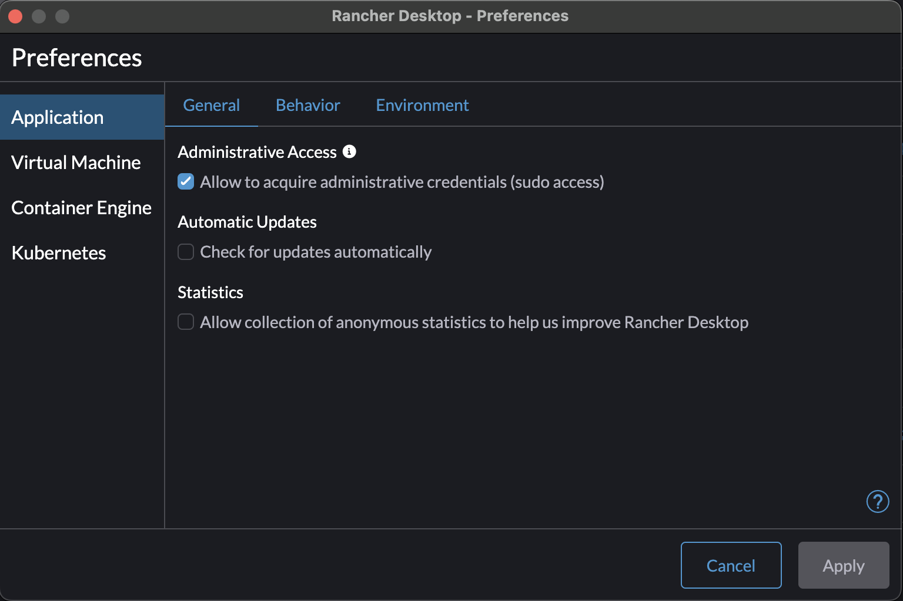
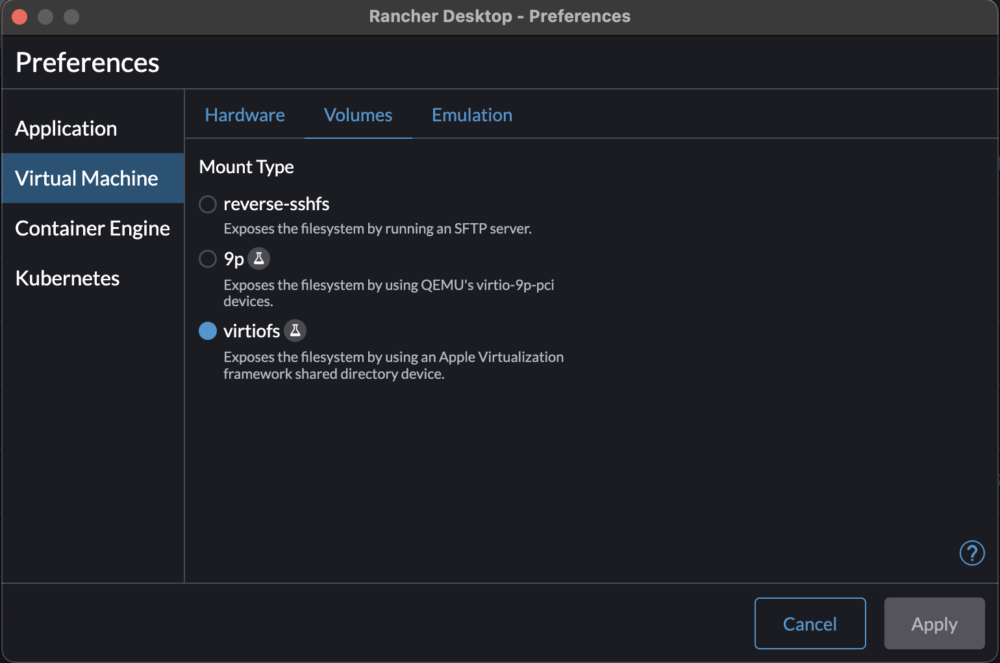
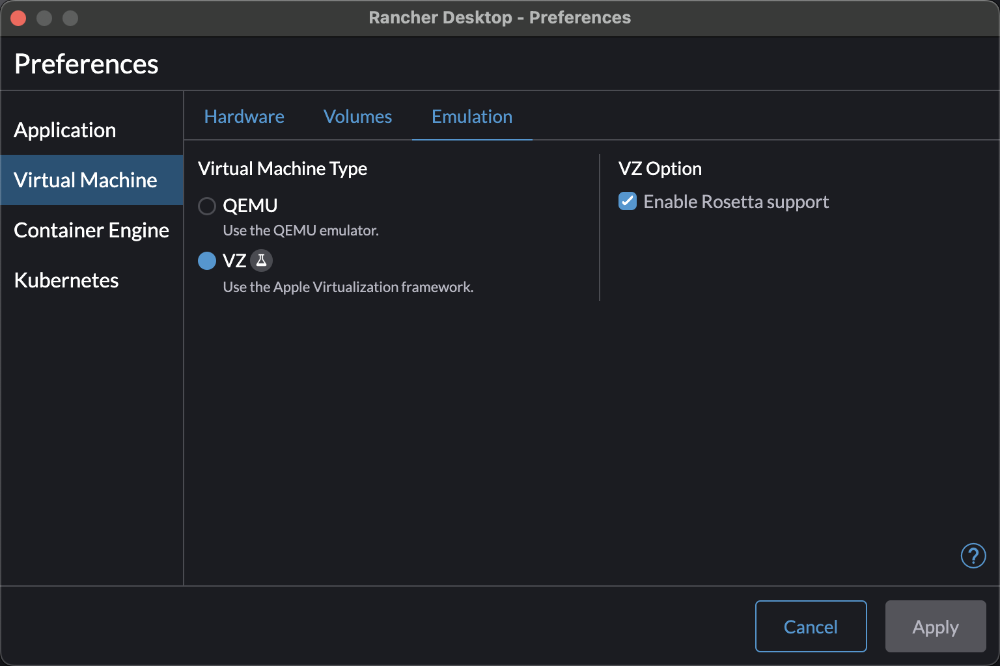

# Rancher Settings
## Mac Settings



**Note**: On an Intel Mac there will be no "Enable Rosetta Support" this is fine/ expected.

## Windows Settings
 1. Install windows WSL
```bash
wsl install --no-distribution
```
2. Follow the installation guide here: https://docs.rancherdesktop.io/1.7/getting-started/installation#installing-rancher-desktop-on-windows