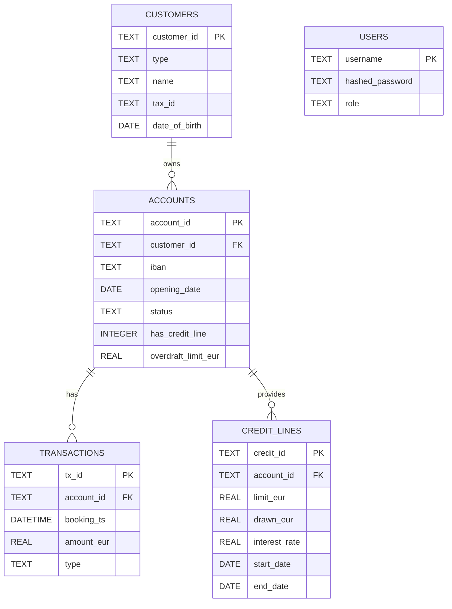

# GFM Bank Core Banking Simulation Dataset

This SQLite dataset simulates the core banking system of **GFM Bank**, modeling key entities and transactions for a realistic demonstration of banking operations. It includes customer profiles, account data, credit facilities, transaction histories, and user access roles.

## 📁 Tables Overview

### 1. `customers`
Stores customer details.

| Column Name     | Type   | Description                |
|------------------|--------|----------------------------|
| `customer_id`    | TEXT   | Unique customer identifier |
| `type`           | TEXT   | Type of customer (e.g., individual, business) |
| `name`           | TEXT   | Full name of the customer  |
| `tax_id`         | TEXT   | Tax identification number  |
| `date_of_birth`  | DATE   | Date of birth              |

---

### 2. `accounts`
Stores bank account information linked to customers.

| Column Name        | Type    | Description                          |
|---------------------|---------|--------------------------------------|
| `account_id`        | TEXT    | Unique account identifier            |
| `customer_id`       | TEXT    | Foreign key to `customers.customer_id` |
| `iban`              | TEXT    | International Bank Account Number    |
| `opening_date`      | DATE    | Account opening date                 |
| `status`            | TEXT    | Account status (active, closed, etc.)|
| `has_credit_line`   | INTEGER | Flag indicating if credit line exists|
| `overdraft_limit_eur` | REAL | Overdraft limit in EUR               |

---

### 3. `credit_lines`
Represents credit facilities assigned to accounts.

| Column Name     | Type  | Description                        |
|------------------|-------|------------------------------------|
| `credit_id`      | TEXT  | Unique credit line identifier      |
| `account_id`     | TEXT  | Foreign key to `accounts.account_id` |
| `limit_eur`      | REAL  | Total credit line limit in EUR     |
| `drawn_eur`      | REAL  | Amount already drawn               |
| `interest_rate`  | REAL  | Interest rate applied              |
| `start_date`     | DATE  | Credit start date                  |
| `end_date`       | DATE  | Credit end date                    |

---

### 4. `transactions`
Logs of account transactions (e.g., transfers, fees, interest).

| Column Name     | Type      | Description                      |
|------------------|-----------|----------------------------------|
| `tx_id`          | TEXT      | Unique transaction identifier    |
| `account_id`     | TEXT      | Foreign key to `accounts.account_id` |
| `booking_ts`     | DATETIME  | Timestamp of booking             |
| `amount_eur`     | REAL      | Transaction amount in EUR        |
| `type`           | TEXT      | Type of transaction (e.g., deposit, withdrawal, fee) |

---

### 5. `users`
Stores application user access credentials and roles.

| Column Name     | Type   | Description                    |
|------------------|--------|--------------------------------|
| `username`       | TEXT   | Username of system user        |
| `hashed_password`| TEXT   | Encrypted password             |
| `role`           | TEXT   | Role (admin, teller, auditor)  |

---

## 🧭 Entity Relationship Diagram



## 🏦 Use Case

This dataset is designed to simulate operations in a core banking system for:

- Account and transaction tracking
- Credit line management
- Overdraft limit simulations
- Role-based user access modeling
- Financial analytics and agentic AI demos

---

## 🧪 Example Use

You can query:

```sql
-- Get balance for a specific account
SELECT SUM(amount_eur) AS balance
FROM transactions
WHERE account_id = 'abc-123';
```

Or simulate overdraft logic and credit limits in an AI agent flow using tools like LangGraph and FastAPI.

---

## 📌 Notes

- All monetary values are in **EUR**
- Time is stored in UTC
- User passwords are **hashed**, never store plaintext passwords
