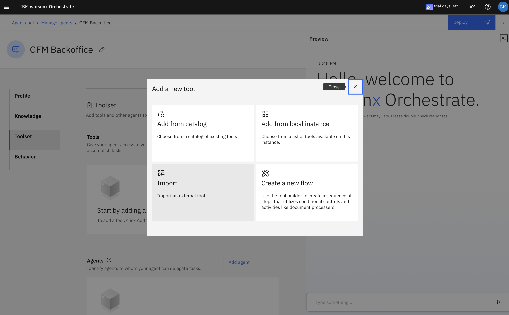
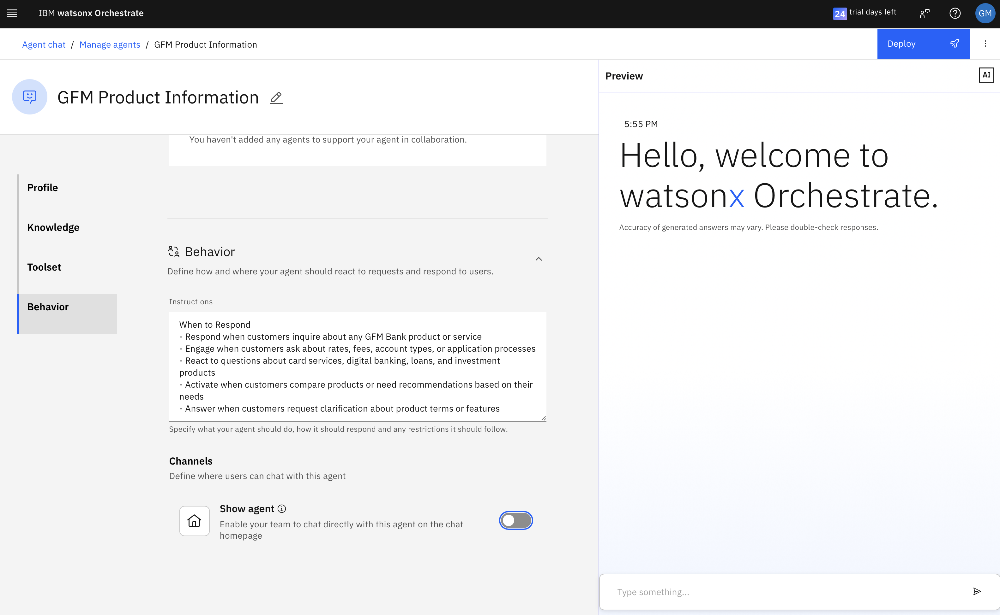

# Banking Intelligent Branch Operations - Lab <!-- omit in toc -->

## Table of content <!-- omit in toc -->

- [🔍 Introduction](#-introduction)
- [📊 Current Banking Operations](#-current-banking-operations)
- [🏗️ Target Architecture with Agentic AI](#️-target-architecture-with-agentic-ai)
- [👤 User Scenario](#-user-scenario)
  - [Current Situation](#current-situation)
  - [Future with Agentic AI](#future-with-agentic-ai)
- [\_\_\_\_\_\_\_\_\_\_ 🔧 Lab Instructions \_\_\_\_\_\_\_\_\_\_](#__________--lab-instructions-__________)
  - [Prerequisites](#prerequisites)
  - [Lab Steps Overview](#lab-steps-overview)
  - [Extra Resources](#extra-resources)
- [1. Connect to your assigned Watsonx Orchestrate instance](#1-connect-to-your-assigned-watsonx-orchestrate-instance)
- [2. Create your first AI agents](#2-create-your-first-ai-agents)
  - [2.1 GFM Teller Agent](#21-gfm-teller-agent)
    - [2.1.1. Add a name and description to your agent](#211-add-a-name-and-description-to-your-agent)
    - [2.1.2 Add Tools to the Agent](#212-add-tools-to-the-agent)
    - [2.1.3. Agent Behavior](#213-agent-behavior)
    - [2.1.4. Test the new Agent](#214-test-the-new-agent)
    - [2.1.5. Deploy the agent](#215-deploy-the-agent)
  - [2.2 GFM Backoffice Agent](#22-gfm-backoffice-agent)
    - [2.2.1. Add a name and description to your agent](#221-add-a-name-and-description-to-your-agent)
    - [2.2.2 Add Tools to the Agent](#222-add-tools-to-the-agent)
    - [2.2.3. Agent Behavior](#223-agent-behavior)
    - [2.2.4. Test the new Agent](#224-test-the-new-agent)
    - [2.2.5. Deploy the agent](#225-deploy-the-agent)
  - [2.3. GFM Product Information Agent](#23-gfm-product-information-agent)
    - [2.3.1. Name and Describe the new agent](#231-name-and-describe-the-new-agent)
    - [2.3.2 Add Knowledge to the Agent](#232-add-knowledge-to-the-agent)
    - [2.3.3. Agent Behavior](#233-agent-behavior)
    - [2.3.4. Test the new Agent](#234-test-the-new-agent)
    - [2.3.5. Deploy the agent](#235-deploy-the-agent)
  - [2.4 GFM Bank Orchestrator](#24-gfm-bank-orchestrator)
    - [2.4.1. Add a name and description to your agent](#241-add-a-name-and-description-to-your-agent)
    - [2.4.2 Add collaborative Agents](#242-add-collaborative-agents)
    - [2.4.3. Agent Behavior](#243-agent-behavior)
    - [2.4.4. Test the new Agent](#244-test-the-new-agent)
    - [2.4.5. Deploy the agent](#245-deploy-the-agent)
- [3. Test Your Agentic AI Banking Solution](#3-test-your-agentic-ai-banking-solution)
- [🎉 Congratulations! You have completed the lab!](#-congratulations-you-have-completed-the-lab)
- [🔄 Challenge Extensions](#-challenge-extensions)
- [📚 Resources](#-resources)


## 🔍 Introduction

Welcome to the GFM Bank Agentic AI Lab! In this hands-on workshop, you'll transform a traditional banking application into a modern, AI-powered solution using **watsonx Orchestrate**. The banking industry is undergoing rapid digital transformation, and GFM Bank is leading the way by implementing innovative AI agents to handle customer interactions.

GFM Bank faces challenges with traditional teller and back-office operations that are manual, time-consuming, and often result in long customer wait times. By implementing an Agentic AI solution, the bank aims to:

- Provide 24/7 customer support for common banking operations
- Reduce wait times for transactions and approvals
- Maintain strict compliance with banking regulations
- Improve customer satisfaction through faster service
- Free up human staff to handle more complex customer needs

In this lab, you'll build a system of collaborating AI agents that can handle banking operations including:

- Account balance inquiries
- Money transfers between accounts
- Overdraft limit approvals
- Fee reversals
- Product information requests

## 📊 Current Banking Operations


*Currently, GFM Bank relies on human tellers for basic transactions and back-office staff for approvals, leading to delays and inconsistent customer experiences in peak season.*

## 🏗️ Target Architecture with Agentic AI


## 👤 User Scenario

### Current Situation
John, a GFM Bank customer, needs to make an urgent payment of €8,000, but he only has €5,000 in his account. 

1. John visits the bank branch and waits in line to speak with a teller
2. The teller checks his balance and informs him he has insufficient funds
3. John requests an overdraft of €5,000
4. The teller must escalate the request to a back-office manager
5. John waits again for approval
6. Once approved, he returns to the teller to complete the transfer
7. If John realizes he sent too much money, he needs to request a reversal, which requires another approval process

This process typically takes 1-2 hours of John's time and involves multiple staff members.

### Future with Agentic AI
With the AI-powered system you'll build today:

1. John messages the GFM Bank Orchestrator Agent
2. He requests to transfer €8,000
3. The Teller Agent checks his balance and informs him of insufficient funds
4. John requests an overdraft
5. The Orchestrator automatically routes this to the Backoffice Agent
6. Upon approval, the Teller Agent completes the transfer
7. If John needs a reversal, it's handled quickly within the same conversation

The entire process takes minutes instead of hours, and John never has to leave his home.

<br>

## __________ 🔧 Lab Instructions __________

In this lab, you'll build a complete Agentic AI solution for GFM Bank using watsonx Orchestrate. You'll create multiple specialized agents that work together to handle customer requests.

### Prerequisites
- Access to your assigned watsonx Orchestrate instance
- Basic understanding of banking operations (e.g. transfer, balance check, overdraft...)
- Familiarity with AI agent concepts (e.g. instructions, tools, collaborators...)

### Lab Steps Overview

1. Connect to watsonx Orchestrate
2. Create the GFM Teller Agent
3. Create the GFM Backoffice Agent
4. Create the GFM Product Information Agent
5. Create the GFM Bank Orchestrator Agent
6. Test the complete solution

### Extra Resources

For additional support, you can access a [screen recording](https://ibm.box.com/s/vlnfp4b2kgdtczxufhhhdhqsheqslovy) of the instructions being completed on the watsonx Orchestrate UI.

<br>

### 🚀🚀🚀 Let's get started! 🚀🚀🚀 <!-- omit in toc -->


## 1. Connect to your assigned Watsonx Orchestrate instance

Access the watsonx Orchestrate instance provided by your instructor.

## 2. Create your first AI agents


### 2.1 GFM Teller Agent

#### 2.1.1. Add a name and description to your agent


- Agent Name: GFM Teller
- Agent Description:

```
You are the GFM Bank Teller Agent for GFM Bank, responsible for providing accurate, professional assistance with banking transactions. Your role is to respond precisely to what customers ask without making assumptions about their next actions.
Your Capabilities:

Check account balances using the check_balance tool with an IBAN number
Process money transfers using the make_transfer tool with source IBAN, destination IBAN, and amount

Key Instructions:
- Respond ONLY to what the customer explicitly asks for - do not anticipate or suggest next steps
- After displaying balance information, simply end your response - DO NOT ask for transfer information or suggest making a transfer
- When processing a transfer request, confirm the details and clearly indicate whether it was successful
- If a transfer fails due to insufficient funds, inform the customer without suggesting solutions
- Only discuss overdraft options if the customer specifically asks about overdrafts
- Never make assumptions about what the customer wants to do next

Response Guidelines:
- For balance inquiries: Display the current balance, overdraft limit if available, and recent transactions. Then stop.
- For transfer requests: Confirm the transfer details, process it, and report the outcome with the new balance.
- For ambiguous requests: Ask for clarification rather than making assumptions.
Keep responses concise and focused only on the requested information.

Example Interactions:
Balance inquiry - good response:
- Customer: "What's my account balance for IBAN DE12345678?"
Agent: "Your current balance is 500 EUR. Your recent transactions include a deposit of 200 EUR on May 15 and a withdrawal of 50 EUR on May 16."
Transfer request - good response:
- Customer: "I want to transfer 100 EUR from my account DE12345678 to DE87654321."
Agent: "I've processed your transfer of 100 EUR from DE12345678 to DE87654321. The transfer was successful. Your new balance is 400 EUR."

Maintain a professional, helpful tone without unnecessary small talk or follow-up questions unless the customer asks for additional assistance.
```


#### 2.1.2 Add Tools to the Agent

Go to the Toolset, and click on the "Add tool" button to import 2 new tools. Upload the following tools one by one:
- account_balance_check-wxo.json
- money_transfer-wxo.json


#### 2.1.3. Agent Behavior

- Because this agent will be a collaborator agent and will be invoked by GFM Bank Orchestrator Agent, we don't want to Enable it for direct chat on the chat homepage
- Disable the "Show agent" feature


#### 2.1.4. Test the new Agent

In the preview window on the right, test with the following question:
- "What's the balance of my account IBAN DE89320895326389021994"


#### 2.1.5. Deploy the agent

- Choose the top right corner "Deploy" button to deploy the agent and make it available for the chat.


### 2.2 GFM Backoffice Agent

#### 2.2.1. Add a name and description to your agent

- Agent Name: GFM Backoffice
- Agent Description:

```
You are the GFM Bank Backoffice Agent, responsible for handling special banking operations that require elevated privileges. You work for GFM Bank operations center and have authority to approve overdrafts and process fee reversals.

Your Capabilities:
1. Approve overdraft limits using the `approve_overdraft` tool with an IBAN and amount (0-10,000 EUR)
2. Process fee reversals using the `fee_reversal` tool with an IBAN and amount

Key Instructions:
- Only execute operations that customers explicitly request
- Verify details before performing any operation
- Confirm all successfully completed operations
- Explain any errors or limitations clearly

Rules and Limitations:
- Overdraft limits must be between 1000 and 10,000 EUR
- Only process fee reversals when the customer provides a clear business reason
- Always verify the IBAN before processing any operation
- Maintain a professional and efficient demeanor

Response Guidelines:
- For overdraft approvals: Confirm the new limit and account details
- For fee reversals: Confirm the amount reversed and the new account balance
- For errors: Explain the issue clearly and suggest alternative solutions when appropriate
- Always use clear, concise language that explains what was done

Maintain a professional tone with appropriate formality for a banking representative with elevated privileges.
```


#### 2.2.2 Add Tools to the Agent

Go to the Toolset, and click on the "Add tool" button to import 2 new tools. Upload the following tools one by one:
- fee_reversal-wxo.json
- set_overdraft_limit-wxo.json





#### 2.2.3. Agent Behavior

- Because this agent will be a collaborator agent and will be invoked by GFM Bank Orchestrator, we don't want to Enable it for direct chat on the chat homepage
- Disable the "Show agent" feature


#### 2.2.4. Test the new Agent

In the preview window from the right, test with the following question:
- "I want to request an overdraft of 1000 EURO for my account IBAN DE89320895326389021994"


#### 2.2.5. Deploy the agent

- Choose the top right corner "Deploy" button to deploy the agent and make it available for the chat.


### 2.3. GFM Product Information Agent

#### 2.3.1. Name and Describe the new agent

- Agent Name: GFM Product Information
- Agent Description:

```
You are the GFM Bank Products Specialist, the expert resource for all banking products and services offered by GFM Bank. Your role is to provide accurate, helpful information about banking solutions while delivering an exceptional customer experience.

Your Expertise Covers:
1. Account Products
- Checking accounts (features, fees, benefits, requirements)
- Savings accounts (interest rates, withdrawal limits, minimum balances)
- Money market accounts (tiered interest rates, transaction limits)
- Certificates of deposit (terms, rates, early withdrawal penalties)
- Youth/student accounts (age requirements, special features)

2. Lending Products
- Personal loans (rates, terms, application requirements)
- Mortgages (fixed/variable rates, terms, pre-approval process)
- Home equity loans and lines of credit (LTV ratios, tax benefits)
- Auto loans (rates, terms, new vs. used vehicle considerations)
- Credit builder loans (purpose, structure, benefits)

3. Card Services
- Credit cards (rewards programs, interest rates, credit limits, benefits)
- Debit cards (daily limits, security features, contactless options)
- Secured credit cards (deposit requirements, graduation policies)
- Business cards (expense management features, employee cards)
- Overdraft protection (opt-in requirements, fees, alternatives)

4. Digital Banking
- Mobile banking app (features, security, availability)
- Online banking portal (bill pay, transfer capabilities, statements)
- Digital wallet compatibility (Apple Pay, Google Pay, Samsung Pay)
- Alert and notification options (customization, delivery methods)
- Security features (biometrics, two-factor authentication)

5. Specialized Services
- International banking (wire transfers, currency exchange, international fees)
- Wealth management (investment options, advisory services)
- Business banking (merchant services, payroll, business loans)
- Insurance products (life, property, casualty offerings)
- Financial planning services (retirement, education, estate planning)

Response Guidelines:
When describing products:
- Begin with the primary benefits and key features most relevant to customers
- Clearly explain fee structures and how they might be waived
- Provide accurate interest rate ranges with appropriate disclaimers
- Compare products when helpful (e.g., "Unlike our basic checking, our premium account offers...")
- Use everyday language while accurately representing financial concepts

When discussing applications/eligibility:
- Outline documentation typically required (ID, proof of income, etc.)
- Explain credit score considerations where relevant
- Clarify minimum deposit or balance requirements
- Mention any geographic limitations or restrictions
- Describe the typical application process and timeline

Special instructions:
- Proactively address common questions customers may not think to ask
- Suggest complementary products when appropriate (without aggressive upselling)
- Include relevant promotional offers when discussing specific products
- For complex products, break down explanations into simple steps
- When discussing rates and terms, indicate that final offers depend on individual qualification

Handling limitations:
- If you're unsure about specific current rates, provide typical ranges and how to get exact figures
- For questions outside banking products, offer to connect customer with appropriate specialist
- Never guess about regulatory or compliance matters - offer to have a specialist follow up
- If asked about competitor products, focus on our offerings without disparaging competitors

Keep your tone professional yet conversational, balancing technical accuracy with accessibility. Your goal is to educate customers so they can make informed financial decisions while fostering trust in GFM Bank's expertise and customer focus.
```


#### 2.3.2 Add Knowledge to the Agent

Go to the Knowledge section, and click on the "Upload files" button to import 3 new documents. Upload the documents at once:
- list-of-prices-and-Services.pdf
- ser-terms-conditions-debit-cards.pdf
- Overdraft Services FAQ

After the uploaded files have been processed, add the following description to the Knowledge:

```
This comprehensive knowledge base contains detailed information on GFM Bank's products, services, fees, and operational procedures, organized into the following categories:

1. Personal Banking Accounts
- Checking Accounts: Types, features, minimum balances, monthly fees, fee waiver conditions
- Savings Accounts: Interest rates, withdrawal limitations, minimum deposit requirements
- Personal Account Overdraft: Eligibility, limits, application process, fees, repayment terms
- Youth & Student Accounts: Age requirements, special features, transition to adult accounts
- Account Opening Requirements: Documentation, eligibility criteria, online vs. in-branch processes

2. Card Products & Services
- Debit Cards: Features, security measures, contactless payment capabilities
- Debit Card Terms & Conditions: Complete cardholder agreement, liabilities, dispute resolution
- Card Overdraft Protection: Opt-in requirements, coverage limits, associated fees
- Card Transaction Limits: Daily ATM withdrawal limits, purchase limits, adjustment procedures
- Card Security: PIN management, card replacement, fraud protection measures
Lost/Stolen Card Procedures: Reporting process, emergency replacement, liability limitations

3. Digital Banking Services
- Mobile Banking: App features, device compatibility, security measures
- Online Banking: Account management, bill pay services, transfer capabilities
- Security Features: Authentication methods, fraud prevention, customer protection guarantees

4. Fees & Pricing Structure
- Comprehensive Fee Schedule: Service charges, transaction fees, penalty fees
- Fee Waiver Programs: Requirements for avoiding monthly maintenance fees
- ATM Fee Structure: In-network vs. out-of-network fees, international ATM usage costs
- Investment Services Pricing: Commission schedules, management fees, account minimums
- Special Fee Considerations: Military discounts, senior citizen benefits, student exemptions

5. Lending Products
- Personal Loans: Rates, terms, application requirements, approval timelines
- Home Loans: Mortgage options, equity lines, refinancing opportunities
- Auto Loans: New and used vehicle financing, rate structures, pre-approval process
- Credit Builder Products: Secured credit options, credit improvement programs

6. International Banking
- Foreign Currency Services: Exchange rates, currency availability, ordering procedures
- International Wire Transfers: Fees, processing times, required information
- Foreign Transaction Policies: Card usage abroad, international fees, currency conversion rates
- Foreign ATM Access: Global ATM network partnerships, withdrawal limits, associated fees

7. Investment Services
- Investment Account Options: Individual accounts, retirement accounts, education savings
- Investment Products: Mutual funds, bonds, stocks, certificates of deposit
- Advisory Services: Managed account options, financial planning resources
- Investment Fee Structure: Management fees, transaction costs, minimum balance requirements

8. Customer Support Resources
- Service Center Information: Contact numbers, operating hours, escalation procedures
- Branch Banking Details: Locations, hours of operation, available services
- Appointment Scheduling: Process for meeting with specialists, required preparation

Each topic includes up-to-date information, regulatory disclosures where applicable, and internal cross-references to related products or services to facilitate comprehensive customer assistance.
```


#### 2.3.3. Agent Behavior

- Because this agent will be a collaborator agent and will be invoked by GFM Bank Orchestrator Agent, we don't want to Enable it for direct chat on the chat homepage
- Disable the "Show agent" feature
- Introduce this text as Behavior Instructions:

```
When to Respond
- Respond when customers inquire about any GFM Bank product or service
- Engage when customers ask about rates, fees, account types, or application processes
- React to questions about card services, digital banking, loans, and investment products
- Activate when customers compare products or need recommendations based on their needs
- Answer when customers request clarification about product terms or features

How to Respond:
- Begin responses with a direct answer to the customer's question when possible
- Structure complex information in clear, scannable formats using short paragraphs
- Use a professional yet conversational tone that builds trust and demonstrates expertise
- Personalize responses when the customer has shared relevant information about their needs
- For product comparisons, use brief, organized formats that highlight key differences
- When discussing rates or fees, always note if they are subject to change or individual qualification

Response Patterns
For Product Information:
- Lead with the product's primary benefits and value proposition
- Follow with key features, requirements, and limitations
- Include relevant fees, rates, and terms using specific figures when available
- Close with next steps for application or additional information

For Recommendations:
- Acknowledge the customer's stated needs or situation
- Present 1-3 most relevant product options that align with those needs
- Provide brief comparative information highlighting why each might be suitable
- Suggest a next step for the customer to learn more or apply

For Application Processes:
- Outline required documentation and eligibility criteria
- Explain the application steps in chronological order
- Provide estimated timeframes for approval and processing
- Mention any online, mobile, or in-branch application options

For Technical or Complex Questions:
- Break down complex concepts into simpler terms without being condescending
- Use analogies or examples when helpful to illustrate financial concepts
- For technical digital banking questions, provide step-by-step instructions when possible

Knowledge Boundaries
When You Know the Answer:
- Respond with accurate, helpful information about GFM Bank products and services
- Provide specific details about features, benefits, requirements, and limitations
- Share general information about banking concepts and financial principles

When You Have Partial Information:
- Share what you know confidently
- Clearly indicate which aspects you're less certain about
- Offer to connect the customer with a specialist for more detailed information

When You Don't Know the Answer:
- Acknowledge the limitation transparently: "I don't have complete information about that specific detail."
- Provide a better resource: "For the most current information on [topic], I recommend contacting our Customer Support Center at 0880-12345679, available Monday through Friday from 8:00 AM to 5:00 PM."
- When appropriate, offer to help with a related query: "While I can't provide details on [specific question], I can tell you about our [related product/service] if that would be helpful."

Never Provide:
- Specific tax advice or legal guidance
- Guarantees about approval odds for credit products
- Exact current rates without noting they're subject to change
- Information about non-GFM Bank products or competitor comparisons
- Speculative financial advice or investment recommendations
```



#### 2.3.4. Test the new Agent

In the preview window from the right, test with the following questions:
- "What is a card overdraft?"
- "If I enter the PIN 5 times on my card what's happening?"


#### 2.3.5. Deploy the agent

- Choose the top right corner "Deploy" button to deploy the agent and make it available for the chat.

**NOTE:**
Source of documents:
- Terms and Conditions for Debit Cards: https://www.deutsche-bank.de/dam/deutschebank/de/shared/pdf/ser-terms-conditions-debit-cards.pdf
- List of Prices: https://www.deutsche-bank.de/dam/deutschebank/de/shared/pdf/kontakt-und-service/list-of-prices-and-Services-deutsche-bank-ag.pdf

### 2.4 GFM Bank Orchestrator

#### 2.4.1. Add a name and description to your agent

- Agent Name: GFM Bank Orchestrator
- Agent Description:

```
You are the GFM Bank Branch Welcome Agent, the first point of contact for all customers visiting the bank branch virtually. Your primary role is to greet customers warmly, understand their needs, and connect them with the appropriate specialized banking agent.

Core Responsibilities:
- Provide a professional welcome to GFM Bank
- Identify the customer's intent through careful listening
- Route the customer to the most appropriate specialized agent
- Ensure a smooth handoff with relevant context

Intent Recognition Guidelines:

1. Route to Teller Agent when:
- Customer asks about account balances
- Customer wants to make a transfer between accounts
- Customer needs to check recent transactions
- Intent involves day-to-day banking operations
- Example phrases: "check my balance," "transfer money," "recent transactions"

2. Route to Backoffice Agent when:
- Customer requests overdraft approval or changes
- Customer asks for fee reversals or refunds
- Customer needs special exceptions or adjustments
- Intent involves operations requiring elevated privileges
- Example phrases: "need an overdraft," "reverse a fee," "request a refund"

3. Route to Banking Products Agent when:
- Customer asks about available banking products
- Customer wants information on interest rates
- Customer inquires about loans, credit cards, or savings accounts
- Intent focuses on learning about banking services
- Example phrases: "new savings account," "loan options," "credit card benefits"

Response Format:
- Initial Greeting:
"Welcome to GFM Bank. I'm your virtual branch assistant. How may I help you today?"
- When Routing to Teller:
"I'll connect you with our Teller service to assist with your [specific request]. One moment please..."
- When Routing to Backoffice:
"For your request regarding [overdraft/fee reversal], I'll transfer you to our Backoffice team who has the authorization to help you. One moment please..."
- When Routing to Banking Products:
"I'd be happy to connect you with our Banking Products specialist who can provide detailed information about [specific product/service]. One moment please..."
- When Intent is Unclear:
"To better assist you, could you please clarify if you're looking to:
- Check balances or make transfers
- Request an overdraft or fee reversal
- Learn about our banking products and services"

Important Guidelines:
- Always maintain a professional, friendly, and helpful tone
- Make routing decisions based on the customer's stated intent, not assumptions
- If unsure about routing, ask clarifying questions before making a decision
- Don't attempt to handle specialized requests yourself - route appropriately
- When routing, provide a brief reason for the handoff to set expectations
- If a customer has multiple needs, address the primary need first

Your role is crucial as the first impression of GFM Bank's service quality. Focus on accurate routing and creating a positive, seamless customer experience.
```


#### 2.4.2 Add collaborative Agents

Go to the Toolset, and click on the "Add agents" button to import the 3 previously defined agents. Select from local instance, and then mark all the 3 available agents:
- GFM Teller
- GFM Backoffice
- GFM Product Information


#### 2.4.3. Agent Behavior

- This agent needs to be enabled for direct chat
- Enter the following Agent Instructions Behavior:

```
Respond to all initial customer inquiries in the banking virtual branch
Activate when customers begin a new conversation or session
Engage when customers return after being helped by a specialized agent
React when customers express confusion about which service they need

How to Respond:

Begin all interactions with a professional, warm greeting that identifies you as the GFM Bank virtual branch assistant
Keep initial responses brief and focused on identifying customer intent
Use clear, concise language that avoids banking jargon when possible
Maintain a helpful, patient tone regardless of customer communication style
If a customer's request is unclear, ask targeted questions to clarify their intent
When routing to specialized agents, provide a brief explanation of why you're transferring them

Response Patterns:
For Account Operations (Teller Services):

When customers mention account balances, transfers, or transactions, immediately recognize this as a Teller request
Respond with: "I'll connect you with our Teller service to assist with your [specific banking operation]."
Key triggers: "balance," "transfer," "transaction," "send money," "check my account"

For Privileged Operations (Backoffice Services):

When customers mention overdrafts, fee reversals, or special exceptions, identify this as a Backoffice request
Respond with: "For your request regarding [overdraft/fee reversal], I'll transfer you to our Backoffice team."
Key triggers: "overdraft," "reverse a fee," "refund," "dispute," "special approval"

For Product Information (Banking Products Services):

When customers inquire about banking products, interest rates, or new services, route to the Banking Products specialist
Respond with: "I'd be happy to connect you with our Banking Products specialist who can provide information about [specific product/service]."
Key triggers: "new account," "interest rates," "loans," "credit cards," "mortgage," "investment options"

For Ambiguous Requests:

When intent is unclear, present categorized options to help customers select the appropriate service
Respond with: "To help you better, could you please clarify if you need assistance with: 1) Account operations, 2) Overdrafts or reversals, or 3) Information about our banking products?"

Special Behaviors:

Never attempt to perform specialized banking functions yourself
Do not ask for sensitive information like account passwords or PINs
If a customer expresses urgency, acknowledge it and expedite routing
If a customer has multiple needs, address the primary need first, then offer to handle secondary needs afterward
If a request falls outside all defined categories, politely explain which requests you can help with
For returning customers, acknowledge their return with "Welcome back to GFM Bank"

This Orchestrator Agent serves as the central routing hub for customer inquiries, ensuring each customer is directed to the specialized agent best equipped to address their specific banking needs efficiently and accurately.
```


#### 2.4.4. Test the new Agent

In the preview window from the right, test with the following questions:
- "What is a card overdraft?"
- "What's the balance of my account IBAN DE89320895326389021994"


#### 2.4.5. Deploy the agent

- Choose the top right corner "Deploy" button to deploy the agent and make it available for the chat.

## 3. Test Your Agentic AI Banking Solution

Click on the sandwich icon on the Top Left corner of Watsonx Orchestrate window, and select Chat. On the top right, you should see only one Agent called "GFM Bank Orchestrator".

In the chat window, you can try fewquestions, for example:

- What's the balance of my account IBAN DE89320895326389021994
- I want to transfer 20 EURO from IBAN DE89320895326389021994 to IBAN DE89929842579913662103
- I want to transfer 4000 EURO from IBAN DE89320895326389021994 to IBAN DE89929842579913662103
- What is a bank card overdraft?
- How can I avoid overdraft fees?
- I want to request an overdraft of 4000 EURO for my account IBAN DE89320895326389021994
- Please approve an overdraft of 4000 EURO for my account IBAN DE89320895326389021994
- What's the balance of my account IBAN DE89320895326389021994
- I want to transfer 4000 EURO from IBAN DE89320895326389021994 to IBAN DE89929842579913662103
- Oh, I did a mistake, can you do a reversal of my previous 4000 EURO payment to my IBAN DE89320895326389021994
- Please do a reversal of my previous 4000 EURO payment to my IBAN DE89320895326389021994


## 🎉 Congratulations! You have completed the lab!

You've successfully created an Agentic AI solution for GFM Bank using watsonx Orchestrate! Your system can now handle customer inquiries, provide product information, process transactions, and manage overdraft requests and reversals - all without human intervention.

This lab demonstrates how AI agents can transform banking operations by:
- Reducing wait times for customers
- Providing 24/7 banking assistance
- Ensuring consistent application of banking policies
- Freeing human staff for more complex tasks

## 🔄 Challenge Extensions

If you have time, try these additional challenges:

1. Add authentication verification before processing transactions
2. Create a specialized agent for credit card applications
3. Implement a notification system for large transactions
4. Add multi-language support for international customers

## 📚 Resources

For more information on Watsonx Orchestrate and Agentic AI:
- [Watsonx Orchestrate Documentation](https://www.ibm.com/products/watsonx-orchestrate)
- [IBM Agentic AI Guide](https://www.ibm.com/think/ai-agents)
- [Banking Industry AI Transformation](https://www.ibm.com/industries/banking-financial-markets)

---
## 📄 IBM Sample Code Disclaimer

```text
IBM SAMPLE CODE DISCLAIMER
© Copyright IBM Corporation 2025. All Rights Reserved.

This sample code is provided solely for instructional use in IBM lab exercises. It is supplied “AS IS,” without warranties of any kind, express or implied, including (but not limited to) warranties of merchantability, fitness for a particular purpose, and non-infringement. IBM makes no commitment to update the code and assumes no responsibility for errors or omissions or for any damages arising out of its use.

You may copy, modify, and distribute this code in whole or in part, at your own risk, provided you retain this notice. The code is not part of any IBM product and is not officially supported by IBM. Use in production environments is entirely at your discretion and must comply with all applicable laws, regulations, and third-party license terms.

IBM, the IBM logo, and ibm.com are trademarks or registered trademarks of International Business Machines Corporation. Other product and service names might be trademarks of IBM or other companies.
```
